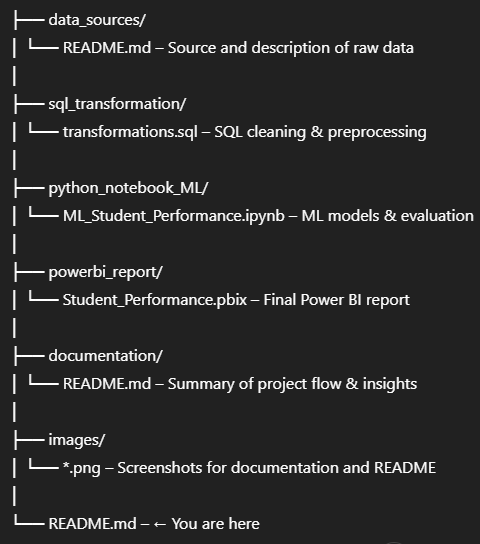
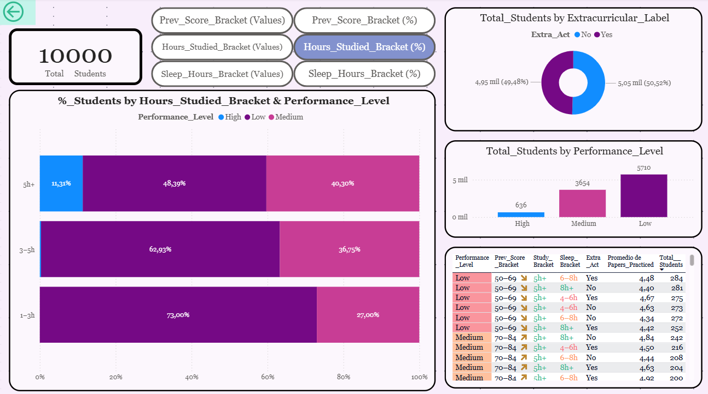
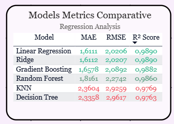
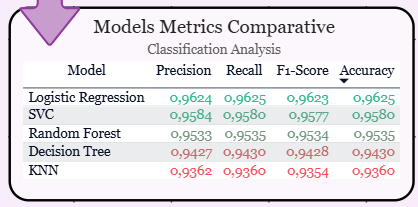

# Student Performance Analysis (Regression & Classification)

This project explores and models student academic performance using both regression and classification techniques. The full workflow includes:

- Data acquisition from a public dataset.
- Data cleaning and transformation using SQL Server.
- Machine learning modeling in Python (regression & classification).
- Visualization and insights with Power BI.

## 🔍 Project Overview

- **Goal:** Understand which factors influence student scores and build predictive models.
- **Dataset:** [Student Performance Dataset on Kaggle](https://www.kaggle.com/datasets/nikhil7280/student-performance-multiple-linear-regression)
- **Tech Stack:** SQL Server, Python (Jupyter Notebook), Power BI

## 📁 Project Structure

## 📊 Power BI Report

Download the full Power BI report:

👉 [Student_Performance_Report.pbix](powerbi_report/Student_Performance_Report.pbix)

---

## 📷 Report Snapshots

### Index

### Base_View – Data Analysis

### Regression – Comparison Matrix

### Classification – Comparison Matrix

---

## 📊 Highlights

- Linear Regression, Ridge & Lasso models compared (regression task).
- Logistic Regression, Random Forest & SVM compared (classification task).
- Clean dashboard with KPIs, metrics, and interpretability visuals.

## 🚀 Getting Started

To explore or reuse this project:
1. Clone the repository
2. Use the included `.sql`, `.ipynb` and `.pbix` files
3. Check the `/documentation` folder for detailed explanations

---
