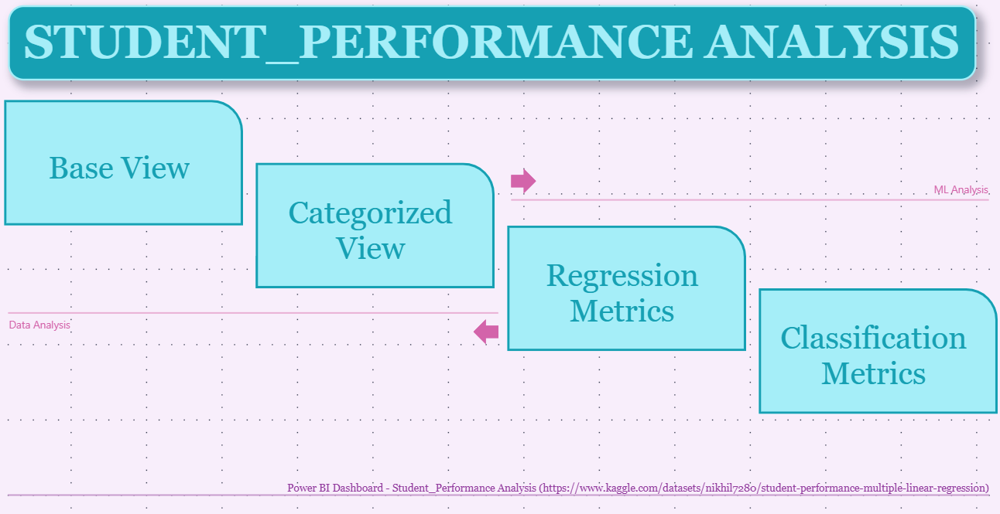

# Student Performance Analysis (Regression & Classification)

This project explores and models student academic performance using both regression and classification techniques. The full workflow includes:

- Data acquisition from a public dataset.
- Data cleaning and transformation using SQL Server.
- Machine learning modeling in Python (regression & classification).
- Visualization and insights with Power BI.

## 🔍 Project Overview

- **Goal:** Understand which factors influence student scores and build predictive models.
- **Dataset:** [Student Performance Dataset on Kaggle](https://www.kaggle.com/datasets/nikhil7280/student-performance-multiple-linear-regression)
- **Tech Stack:** SQL Server, Python (Jupyter Notebook), Power BI

## 📁 Project Structure

├── data_sources/
│ └── README.md – Source and description of raw data
│
├── sql_transformation/
│ └── transformations.sql – SQL cleaning & preprocessing
│
├── python_notebook_ML/
│ └── ML_Student_Performance.ipynb – ML models & evaluation
│
├── powerbi_report/
│ └── Student_Performance.pbix – Final Power BI report
│
├── documentation/
│ └── README.md – Summary of project flow & insights
│
├── images/
│ └── *.png – Screenshots for documentation and README
│
└── README.md – ← You are here

## 📊 Power BI Report

Download the full Power BI report:

👉 [Student_Performance_Report.pbix](powerbi_report/Student_Performance_Report.pbix)

---

## 📷 Report Snapshots

### Index

### Base_View – Data Analysis

### Regression – Comparison Matrix

### Classification – Comparison Matrix

---

## 📊 Highlights

- Linear Regression, Ridge & Lasso models compared (regression task).
- Logistic Regression, Random Forest & SVM compared (classification task).
- Clean dashboard with KPIs, metrics, and interpretability visuals.

## 🚀 Getting Started

To explore or reuse this project:
1. Clone the repository
2. Use the included `.sql`, `.ipynb` and `.pbix` files
3. Check the `/documentation` folder for detailed explanations

---
